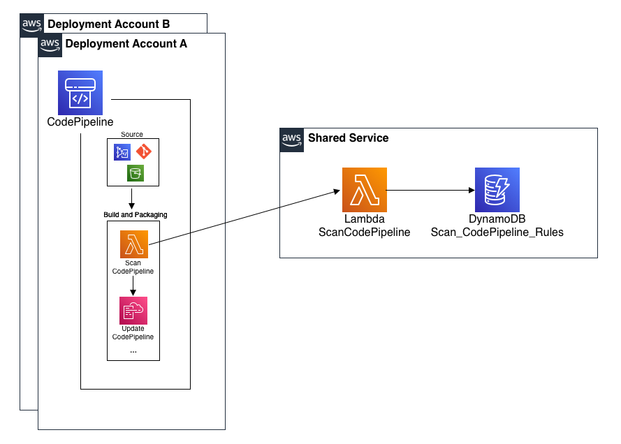
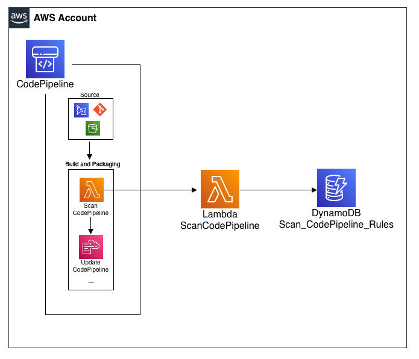
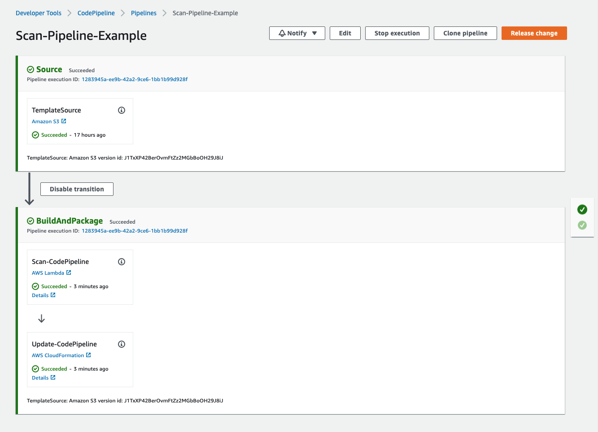
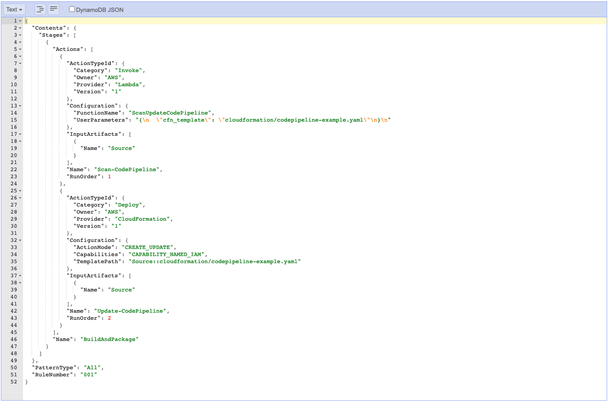
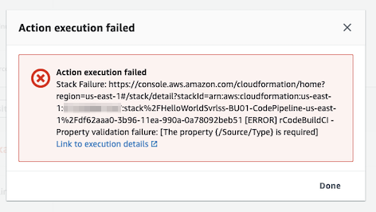
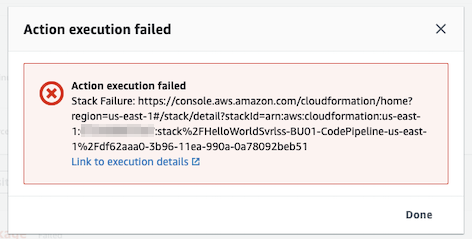
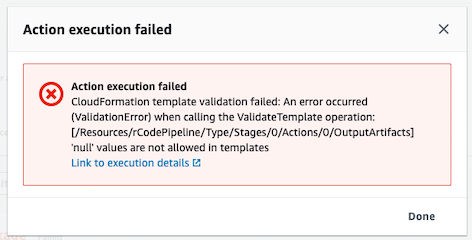
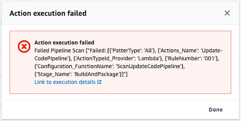

# CodePipeline Governance
Ensure all AWS CodePipelines have mandatory actions being run in the Orchestration Pipeline.

## Description
This solution will be initiated through a pipeline action and will parse through the CodePipeline CloudFormation template to ensure all governance rules are met before updating the CloudFormation Stack.  This 
allows the Security or Governance teams to mandate certain stages and/or actions to being ran in a particular order.  But more importantly, this will allow developers to update their own CI/CD Pipeline.  

### Folder Structure
| Folder/File | Description |  
| :-------------------------| :-------------------------------------------------------------------------------------------------------------------|
| cloudformation/sam-bootstrap.yaml  | AWS Cloudformation template that will create the required AWS Resources for the solution to work properly. It will create an IAM Role, KMS Key/Alias and S3 Bucket. All of these AWS Resources are required for an AWS Serverless Application Model (SAM) deployment to successful.|
| cloudformation/function.yaml | SAM template that will deploy the AWS Lambda Function along with all dependant infrastructure. | 
| src     | Source code for AWS Lambda Functions. |
| test     | Test code for AWS Lambda Functions. |
| scripts   | Directory that has the scripts that will be ran from a CodeBuild BuildSpec file |
| scripts/main.sh | An orchestration script that will run the all other linting/scanning scripts before building/deploying the SAM Function(s). | 
| scripts/pylint.sh   | Shell script that will run the ```pylint``` command against all python files. |
| scripts/pyscan.sh   | Runs Bandit (python lib) against all python code within the repository to identify any security vulnerabilities. |
| scripts/sam.sh   | Runs a number of SAM commands to package / build / deploy the SAM Function to a specified account. | 
| scripts/test.sh   | Shell script that will run the ```tox``` command to build a virtual environment and the ```pytest``` command to run any unit tests found in the repository. |
| pytest.ini   | ini files are the configuration files of the tox project, and can also be used to hold pytest configuration if they have a [pytest] section. |
| test_requirements.txt   | Pip requirements file for test environment. |
| tox.ini | Configured file for Tox. Tox is a command-line driven automated testing tool for Python, based on the use of virtualenv. |

## Pre-requisite Steps:
- Install the Serverless Application Model CLI (SAM) [Link to AWS Doc](https://docs.aws.amazon.com/serverless-application-model/latest/developerguide/serverless-sam-cli-install.html)
  - Since this solution builds the SAM function inside Lambda-like container, Docker must be installed and running on your workstation.

## Solution Architecture
There are 2 ways of deploying the CodePipeline Governance solution. 

### Separate Accounts AWS Resource Diagram (Option 1)
 

The *first deployment* method uses AWS Organizations and Centralized Shared Services account to manage the CodePipeline Governance Lambda Function. 
This method allows other AWS Accounts within the Organization the ability to call the Lambda Function using a specific IAM Role. This eases the 
management of the CodePipeline Governance Lambda Function and enables CodePipeline's within multiple AWS Accounts to invoke the function. 

### Single Account AWS Resource Diagram (Option 2)
 

The *second deployment* method installs the CodePipeline Governance Lambda Function in the same account as your deployment of AWS CodePipeline.  This 
method is typically chosen when a Centralized Shared Services account or AWS Organization isn't used.  

## How to deploy Option 1 (Function and Codepipeline exist in separate accounts)
### Deploy to Shared Services Account
- Run the cloudformation/sam-bootstrap.yaml into the AWS Account. This will deploy an S3 Bucket and KMS Key for the use of the SAM deployment.
  ```bash
  aws cloudformation deploy --stack-name SAM-Bootstrap --template-file cloudformation/sam-bootstrap.yaml
  ```

- Deploy the ScanCodePipeline Serverless Application Model (SAM) Lambda function and dependencies.
    - Replace "Orchestration-Service" if you are using a different CodePipeline Service Role. "Orchestration-Service" is 
      what is used in both CodePipeline examples (codepipeline-example.yaml and codepipeline-sep-acc-example.yaml). 
  ```bash
  # -o => AWS Organizational ID
  # -r => CodePipeline Service Role Name
  
  ORG_ID=$(aws organizations describe-organization --query 'Organization.Id' --output text) 
  bash ./scripts/sam.sh -o ${ORG_ID} -r Orchestration-Service
  ````

- Deploy Initial DynamoDB Item into the Scan_CodePipeline_Rules Table.
  ```bash
  aws dynamodb put-item --table-name Scan_CodePipeline_Rules --item file://initial-dynamodb-item-sep-acc.json
  ``` 
    
### Deploy to AWS CodePipeline Account 
- This deploys an IAM Role for the Lambda Function to assume back into the Pipeline Account to respond with the CodePipeline Status (Success | Failure)
  - Replace "123456789012" with AWS Account where the ScanCodePipeline Lambda Function was deployed
  ```bash
  aws cloudformation deploy --stack-name ScanCodePipelineAssumedRole --template-file cloudformation/assumed-iam-role.yaml --capabilities CAPABILITY_NAMED_IAM --parameter-overrides pScanCodePipelineAccount=123456789012
  ````
  
### Deploy/Run CodePipeline Example
- Deploy CodePipeline (w/ dependencies) CloudFormation template.
  - Replace "123456789012" with AWS Account where the ScanCodePipeline Lambda Function was deployed
  ```bash
  aws cloudformation deploy --stack-name ScanCodePipelineExample --template-file cloudformation/codepipeline-sep-acc-example.yaml --capabilities CAPABILITY_NAMED_IAM --parameter-overrides pScanCodePipelineAccount=123456789012 
  ``` 

- Zip up application directory.
  ```bash
  zip -r application.zip * -x "*.aws-sam*" -x "*.DS_Store*" 
  ```

- Update zip to S3 to initiate the pipeline.
  ```bash
  AWS_ACCOUNT_ID=$(aws sts get-caller-identity --query 'Account' --output text)
  AWS_REGION=$(aws configure get region) || AWS_REGION='us-east-1'
  aws s3 cp application.zip s3://orchestration-${AWS_ACCOUNT_ID}-${AWS_REGION}/application.zip 
  ```
 
## How to deploy Option 2 (Function and Codepipeline exist in the same account)
### Deploy to AWS Account
- Run the cloudformation/sam-bootstrap.yaml into the AWS Account. This will deploy an S3 Bucket and KMS Key for the use of the SAM deployment.
  ```bash
  aws cloudformation deploy --stack-name SAM-Bootstrap --template-file cloudformation/sam-bootstrap.yaml
  ```
  
- Deploy the ScanCodePipeline Serverless Application Model (SAM) Lambda function and dependencies.
  ```bash
  bash ./scripts/sam.sh 
  ````
  
- Deploy Initial DynamoDB Item into the Scan_CodePipeline_Rules Table.
  ```bash
  aws dynamodb put-item --table-name Scan_CodePipeline_Rules --item file://initial-dynamodb-item.json
  ```

### Deploy/Run CodePipeline Example
- Deploy CodePipeline (w/ dependencies) CloudFormation template.
  ```bash
  aws cloudformation deploy --stack-name ScanCodePipelineExample --template-file cloudformation/codepipeline-example.yaml --capabilities CAPABILITY_NAMED_IAM 
  ```

- Zip up application directory.
  ```bash
  zip -r application.zip * -x "*.aws-sam*" -x "*.DS_Store*" 
  ```

- Update zip to S3 to initiate the pipeline.
  ```bash
  AWS_ACCOUNT_ID=$(aws sts get-caller-identity --query 'Account' --output text)
  AWS_REGION=$(aws configure get region) || AWS_REGION='us-east-1'
  aws s3 cp application.zip s3://orchestration-${AWS_ACCOUNT_ID}-${AWS_REGION}/application.zip 
  ```

## What the Pipeline should look like
 

## Deploy New / Update CodePipeline Governance Rules
- Create a yaml file with the CodePipeline Stage or Actions you wish to act as the Rule for the CodePipeline CloudFormation Template.
    - There is an example of a Rule located in *scripts/convert-2-dynamodb-item.yaml*. This example Rule ensures that the Scan 
      Action doesn't get removed from the CodePipeline Template.
    - Additional Notes 
      - Update the *RuleNumber* value if creating multiple rules.
      - *PatternType* is a future feature that will let a users associate certain rules to specific pipelines based on the pipeline's tag. 
    ```yaml
    RuleNumber: "001"
    PatternType: "All" 
    Contents:
      Stages:
        - Name: BuildAndPackage
          Actions:
            - Name: Scan-CodePipeline
              ActionTypeId:
                Category: Invoke
                Owner: AWS
                Provider: Lambda
                Version: "1"
              Configuration:
                FunctionName: ScanUpdateCodePipeline
                UserParameters: |
                  {
                    "cfn_template": "cloudformation/codepipeline-example.yaml"
                  }
              InputArtifacts:
                - Name: Source
              RunOrder: 1
            - Name: Update-CodePipeline
              ActionTypeId:
                Category: Deploy
                Owner: AWS
                Version: "1"
                Provider: CloudFormation
              InputArtifacts:
                - Name: Source
              Configuration:
                ActionMode: CREATE_UPDATE
                Capabilities: CAPABILITY_NAMED_IAM
                TemplatePath: Source::cloudformation/codepipeline-example.yaml
              RunOrder: 2
    ```
 
- Run the convert-2-dynamodb-item script to build the Rule to fit the DynamoDB format.
  ```bash
  python scripts/convert-2-dynamodb-item.py > new_initial-dynamodb-item.json
  ```
  
- Deploy New/Updated DynamoDB Item into the Scan_CodePipeline_Rules Table.
  ```bash
  aws dynamodb put-item --table-name Scan_CodePipeline_Rules --item file://new_initial-dynamodb-item.json
  ``` 
  
End Result - Rule Example (located in DynamoDB):

 

### What can NOT be added to a Governance Rule
- [Intrinsic Functions](https://docs.aws.amazon.com/AWSCloudFormation/latest/UserGuide/intrinsic-function-reference.html)

## How does ScanCodepipeline Function get used in CodePipeline
Example code from CodePipeline.yaml:
```yaml
...
    - Name: BuildAndPackage
      Actions:
        - Name: Scan-CodePipeline
          ActionTypeId:
            Category: Invoke
            Owner: AWS
            Provider: Lambda
            Version: "1"
          Configuration:
            FunctionName: ScanCodePipeline
            UserParameters: !Sub |
              {
                "cfn_template": "iac/cloudformation/codepipeline-example.yaml"
              }
          InputArtifacts:
            - Name: Source
          OutputArtifacts: []
          RunOrder: 1
...
```

## Failure Definitions
CodePipeline action output of CloudFormation deployment failure

 

CodePipeline action output of CloudFormation deployment failure with output being over 500 characters



CodePipeline action output of CloudFormation validation failure 

 

CodePipeline action output of CloudFormation Security Scan

 

## License
This project is licensed under the Apache-2.0 License.
